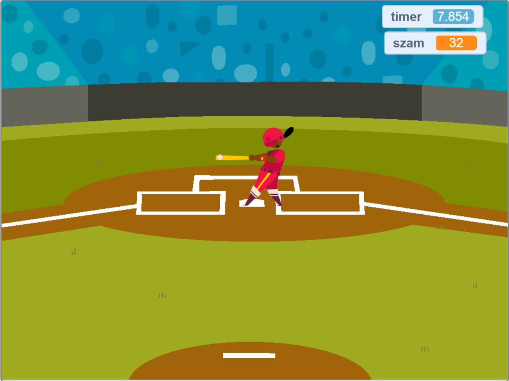
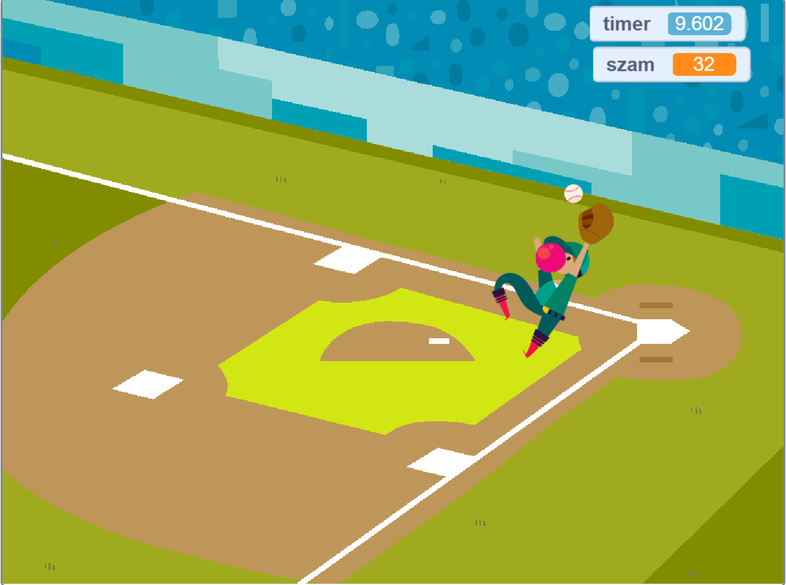

Programozás 1
=============
Scratch feladatok

Az első Backdrop-nál a játékos elüti a labdát. A második Backdrop-nál a kapó elkapja a labdát.
Az első Backdrop-nál a labda mozgását a mozgás és a méretváltoztatás (kicsinyítés jelen esetbe) ciklussal való imétléssel értem el.
A második Backdrop-nál labdát mozgató ciklusban a mozgatáshoz a forgatás is tásul amikor a labda eléri a kesztyű szinét az álló fogó kesztyűjébe kerül. 

